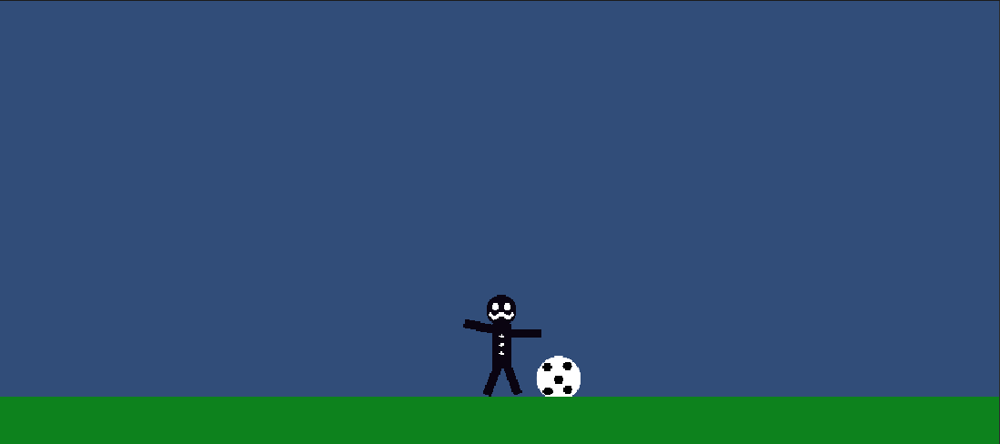

# UnityExperimenting
2D game created in Unity 2021 from the GameDev.tv course "Complete C# Unity Game Developer 2D" on Udemy. This game has several small improvements beyond the tutorial as I tried to make it my own. 

---

**First Screenshot**
======

---

**Link to Udemy Course**
======
**NOTE:** Even though I don't receive any compensation for recommending this course, I highly recommend it to anyone who is new to game development. The course provides an exceptional learning experience taught by some of the most skilled instructors in the industry, exclusively on Unity.

:globe_with_meridians: **Link:** https://www.udemy.com/course/unitycourse/
